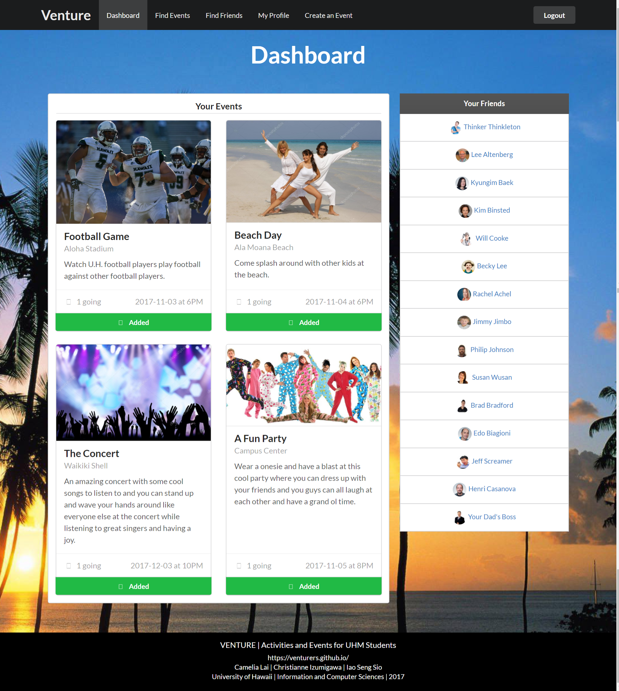

* Github Organization: <https://github.com/venturers>
* Deployment: <http://ventureuhmanoa.meteorapp.com/>
* M2: <https://github.com/venturers/venture/projects/2>

# Table of Contents

* [Overview](#overview)
* [User Guide](#user-guide)
* [Community Feedback](#community-feedback)
* [Developer Guide](#developer-guide)

## Overview

Venture is a web application where UHM students can find activities and events to do with others on the island.

Search for events you might like by interests and by keywords:

You can also search for events by location, time, cost, transportation, and mutual friends using the advanced search feature.

See the all the matches for your search criteria.

Search for friends you might like to go to events with by name or by common interests:

You can also search for friends by location, transportation, and mutual events and friends.

See all the matches for your search criteria.

Create your own profile to allow better event and friend matches:

See profiles of other people to find friends:

See what events you are scheduled to go to and your list of friends:

See the details of each event, including the date and time of the event and the number of people that have signed up for it:

You can even create your own events:

## User Guide

## User Guide

### Login

To get started on your adventures, login with your UH username and password.

-- Landing Picture Here --

#### Dashboard

Welcome to our site!
This is your very own personal dashboard.
This handy page will keep an updated list of your friends and events for you.

-- Dashboard Picture Here --

If you don't have any plans or friends yet, go to a search page to find some!

### Find Events

To find an event you'd like to attend, you can search by the following properties:
 - keywords (ex: beach, football)
 - interests (ex: imu cooking, software engineering)
 - advanced searches (ex: cost of an event, date, and time)

To see a listing of all of the events, press the blue 'Search' button without entering anything into the other fields.

-- Find Picture Here --

### Find Friends

Similar to finding events, you can find friends on our site by searching with the following filters:
 - name (ex: Billy Bob)
 - interests (ex: imu cooking, software engineering)
 - advanced searches (ex: transportation, mutual friends, etc.)

 To see a full list of all of the friends you could possibly make, press the blue 'Search' button without entering anything into the other fields.

-- Find Picture Here --

### Create and Edit Your Own Event

To create your own event, click on the 'Create an Event' tab near the top of the screen and fill in the Event form as best as possible.  Only the 'Name' field is required, but other users are more likely to find and therefore attend an event with more details in it.

-- Create Picture Here --

To edit an event, you must be the one who created it.  If you are the one who created it, navigate to your event's page, and click on the 'Edit Event' button.  This button will take you to an Event form where you can edit your event.

-- Edit Picture Here --

### Viewing and Editing Your Profile Page

To view your public profile page, click on the 'My Profile' tab near the top of the screen.  This tab will take you to the public profile page that everyone will see when they search for friends.  

-- Public Profile Page Here --

To edit your public profile page, click on the button that reads 'Edit Profile'.  Fill up our profile form with as much information as you feel comfortable sharing.  You can even change your profile picture with the URL field.

-- Edit Profile Page Here --

### Comments

Lastly, don't forget to comment on event pages.  
You can also leave your friends a few nice words on their profile page!

-- Picture Here --

Happy Venturing!

### Login

## Community Feedback

## Developer Guide
