* Github Organization: <https://github.com/venturers>
* Deployment: <http://ventureuhmanoa.meteorapp.com/>
* M2: <https://github.com/venturers/venture/projects/2>

# Table of Contents

* [Overview](#overview)
* [User Guide](#user-guide)
* [Community Feedback](#community-feedback)
* [Developer Guide](#developer-guide)

## Overview

Venture is a web application where UH associates can find activities and events to attend with other associates on the island.

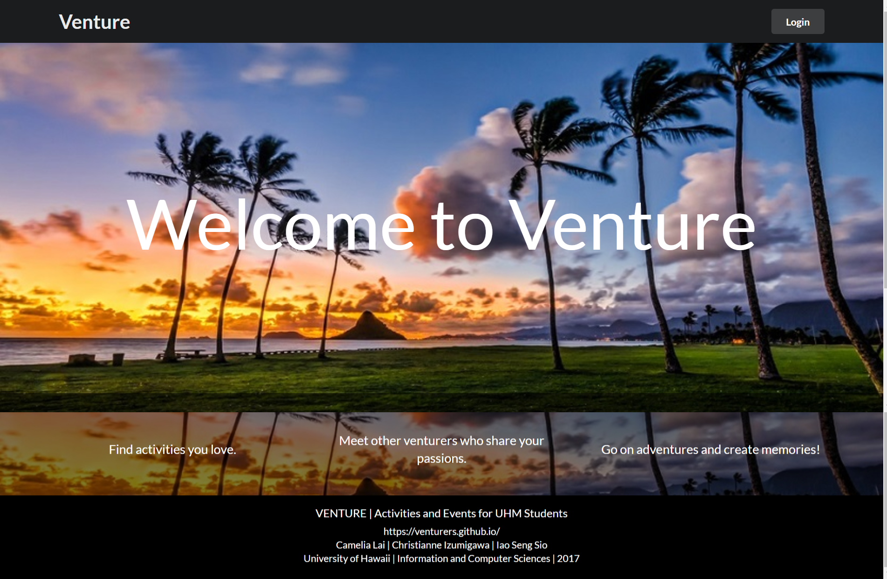

Search for events you might like by interests and keywords:

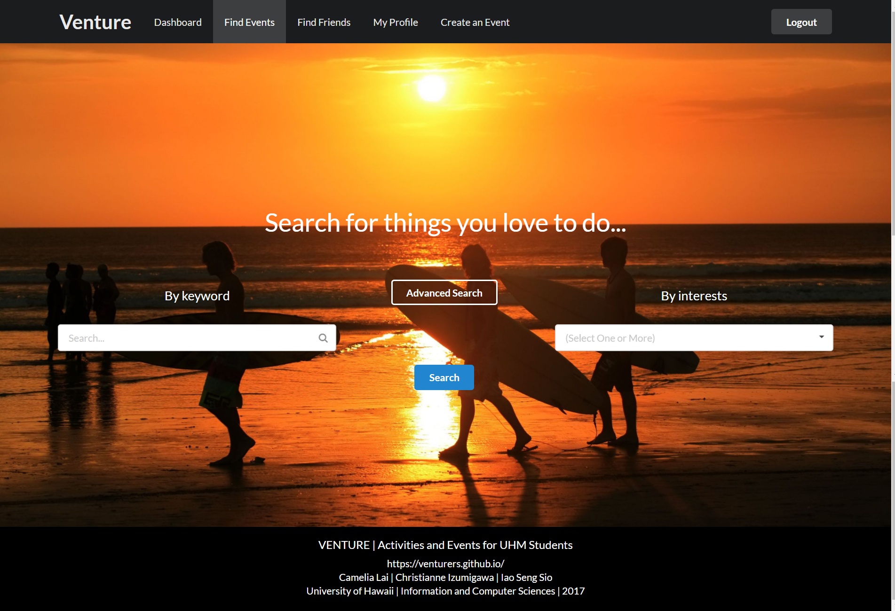

Search for friends you might like to go to events with by name or by common interests:

Create your own profile to allow better event and friend matches:

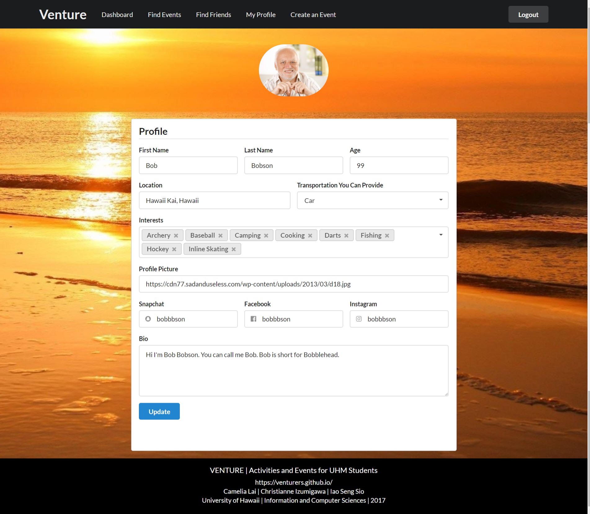

Even create your own events!

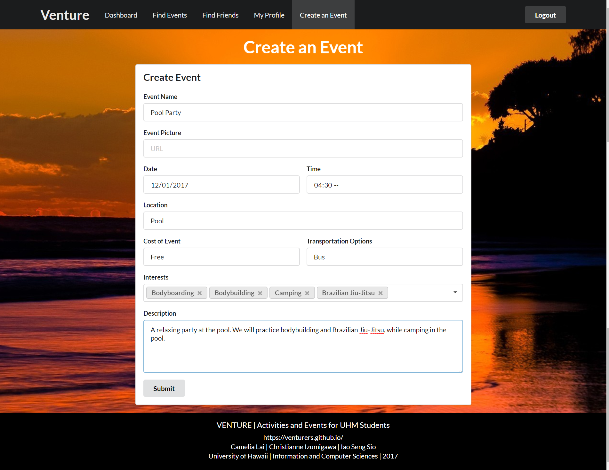

Join Venture Today!

## User Guide

### Login

To get started on your adventures, login with your UH username and password.

#### Dashboard

Welcome to our site!
This is your very own personal dashboard.
This handy page will keep an updated list of your friends and events for you.

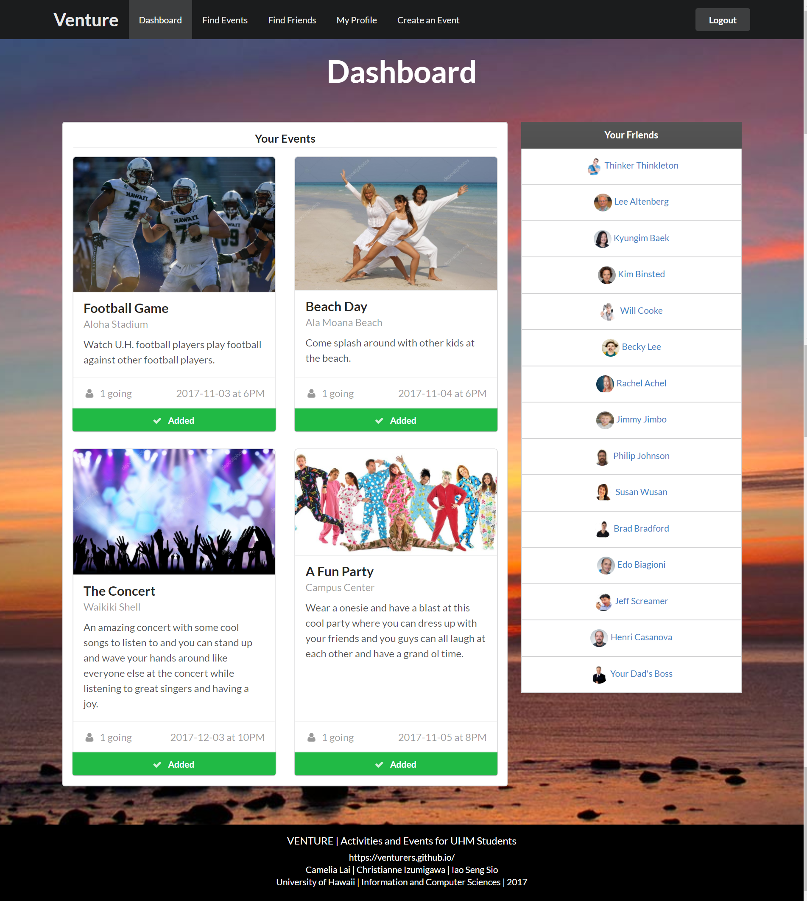

If you don't have any plans or friends yet, go to a search page to find some!

### Find Events

To find an event you'd like to attend, you can search by the following properties:
 - keywords (ex: beach, football)
 - interests (ex: imu cooking, software engineering)
 - advanced searches (ex: cost of an event, date, and time)

To see a listing of all of the events, press the blue 'Search' button without entering anything into the other fields.

Search by interests and by keywords:

Search by location, time, cost, transportation, and mutual friends using the advanced search feature.

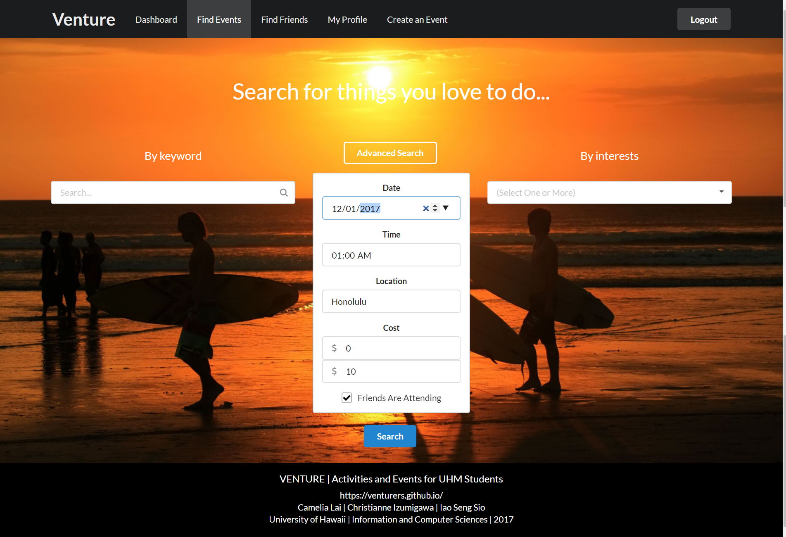

See the all the matches for your search criteria.

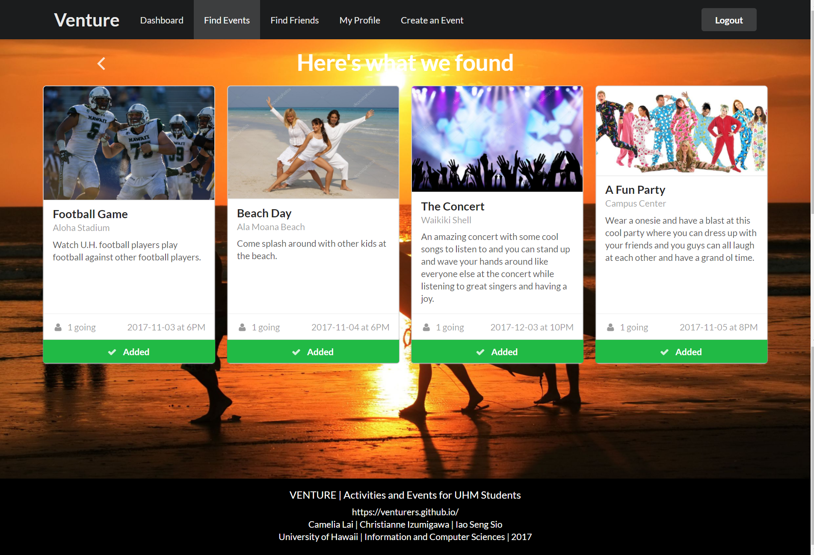

See the details of each event, including the date and time of the event and the number of people that have signed up for it:

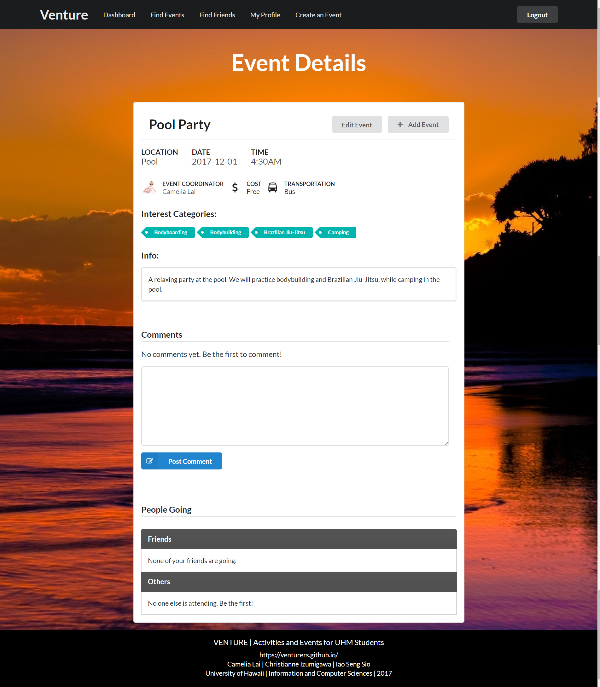

### Find Friends

Similar to finding events, you can find friends on our site by searching with the following filters:
 - name (ex: Billy Bob)
 - interests (ex: imu cooking, software engineering)
 - advanced searches (ex: transportation, mutual friends, etc.)

 To see a full list of all of the friends you could possibly make, press the blue 'Search' button without entering anything into the other fields.

Search by name or by common interests:

Also search by location, transportation, and mutual events and friends.

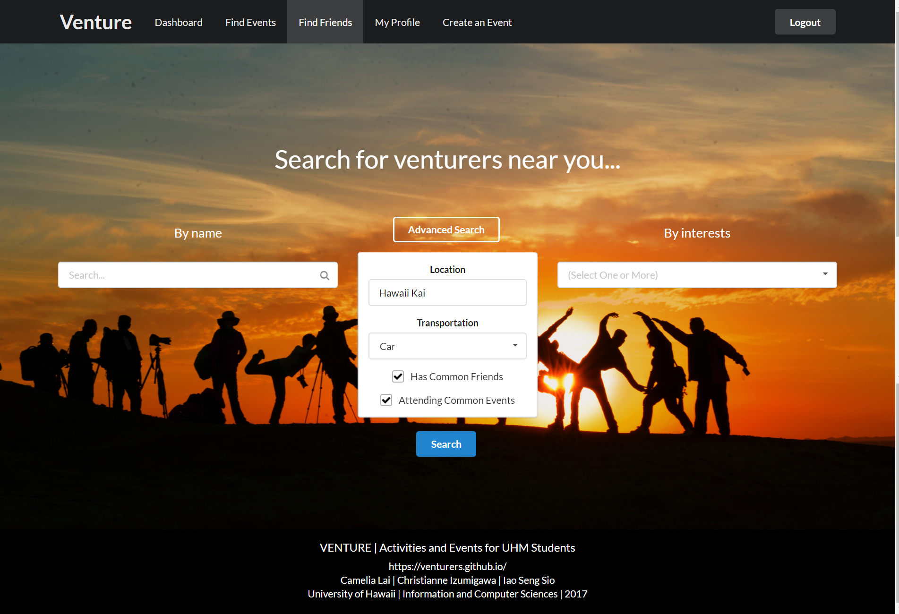

See all the matches for your search criteria.

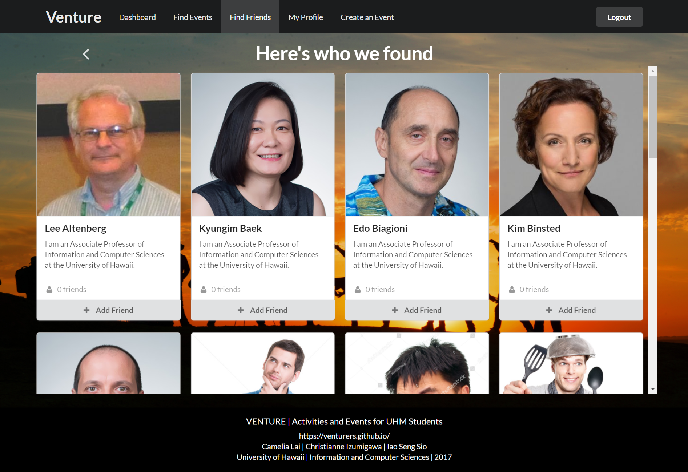

### Viewing and Editing Your Profile Page

To view your public profile page, click on the 'My Profile' tab near the top of the screen.  This tab will take you to the public profile page that everyone will see when they search for friends.  

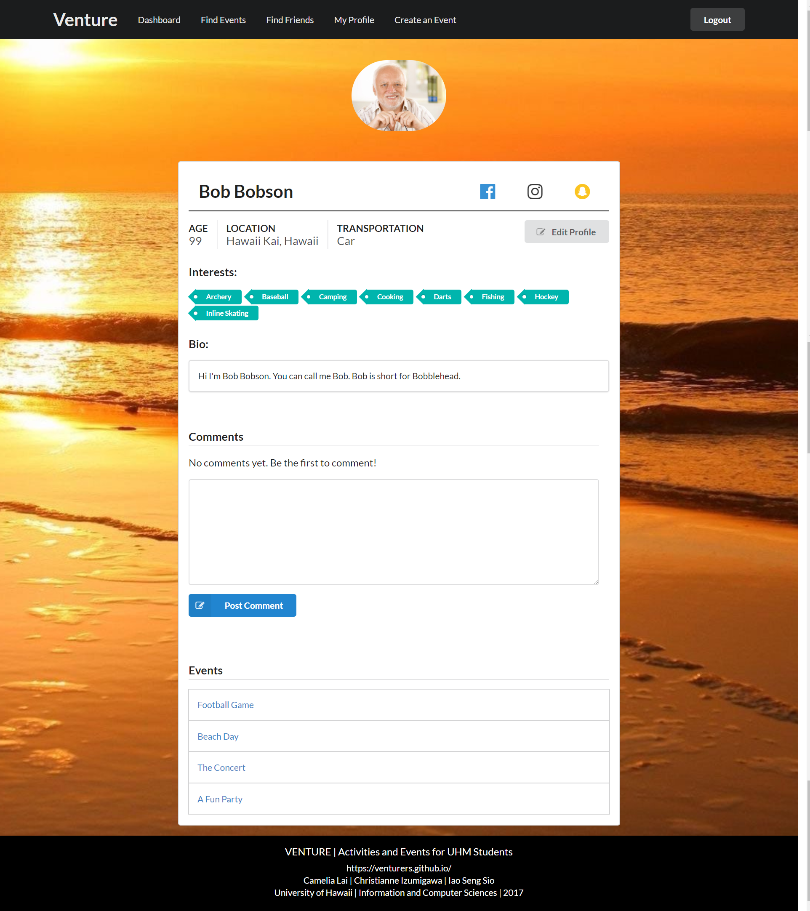

To edit your public profile page, click on the button that reads 'Edit Profile'.  Fill up our profile form with as much information as you feel comfortable sharing.  You can even change your profile picture with the URL field.

### Create and Edit Your Own Event

To create your own event, click on the 'Create an Event' tab near the top of the screen and fill in the Event form as best as possible.  Only the 'Name' field is required, but other users are more likely to find and therefore attend an event with more details in it.

To edit an event, you must be the one who created it.  If you are the one who created it, navigate to your event's page, and click on the 'Edit Event' button.  This button will take you to an Event form where you can edit your event.

### Comments

Lastly, don't forget to comment on event pages.  
You can also leave your friends a few nice words on their profile page!

Happy Venturing!

## Community Feedback

"The site works extremely well, looks appealing and has a lot of potential to do great as a stand alone website." -Fellow Student

Other praise from our viewers:
- Visually and aesthetically appealing
- Simple, nice layout
- Easy to navigate
- Theme is very nice, matches the website's function
- Simple to use

Suggestions from our viewers:
- Clarify search criteria ("transportation" in the advanced search for friends)
- Sort events and friends lists in dashboard
- Friends can't be removed from the dashboard (you have to search for them to remove them)
- You cannot delete an event that you created
- Add a calendar, or notifications of upcoming events, friend requests, comments, etc.

## Developer Guide

### So you think you can develop? Join the team!

### Download the Code

* Clone our Github repository at <https://github.com/venturers/venture>
  - if you don't already have a Git Client, SourceTree and Github Desktop are good clients to start with.

### Install Meteor

* Go to <https://www.meteor.com/install> to download and install Meteor
* Once you've installed Meteor, navigate to our project's 'app' folder:
  - for Mac Users on terminal, assuming the venture folder is on the Desktop: cd Desktop/venture/app
* Now install dependencies with the following command:
  - for Mac Users on terminal: meteor npm install

### Run the Code
* Assuming you're still in the 'app' directory, run the following command on terminal: meteor npm run start
* Wait until you see 'App running at: http://localhost:3000/' appear in your terminal
* Go to <http://localhost:3000/> to see the app run

### Modify the System
* Whenever you make changes to the code, run and test that your feature works
* When you are ready to push your new changes to the repository:
  - commit the code you wrote
  - push the commit
