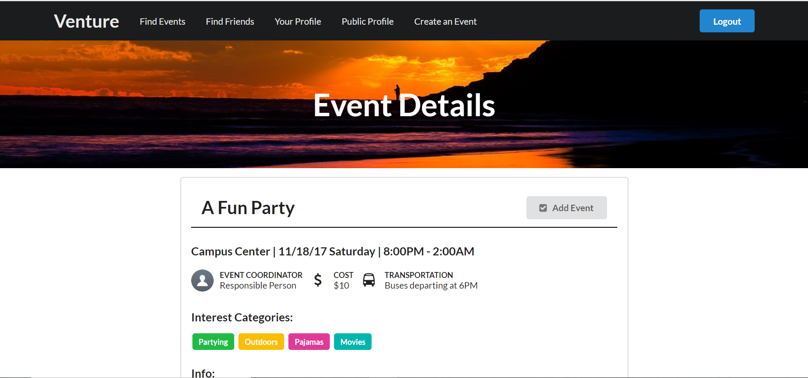

# About Venture

* Deployment: <http://ventureuhmanoa.meteorapp.com/>
* M2: <https://github.com/venturers/venture/projects/2>

Venture is a web application where UHM students can find activities and events to do with others on the island.

Search for events you might like by interests and by keywords:

Search for friends you might like to go to events with by name or by common interests:

Create your own profile to allow better event and friend matches:

See profiles of other people to find friends:

See what events you are scheduled to go to and your list of friends:

See the details of each event, including the date and time of the event and the number of people that have signed up for it:

Even create your own event:

